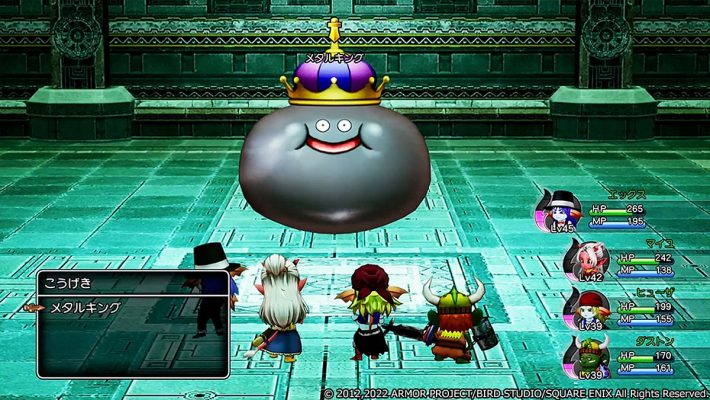

# BattleStrategy


# Outline

## Key Features

## User Login

## Character Creation (1-4 Characters (Pokemon))

Str, Luk, Dex, Int (HP is Str+Dex)
(random roll each stat 1-6)

Class: Warrior (Str [Focused 2x the stat]), Thief (Luck), Mage (Int), Hunter (Dex)

Pick Your Name
```
{
  id:
  char_name:
  char_str:
  char_luk:
  char_dex:
  char_int:
  char_class:
  char_gold:
  char_xp:
  char_level:
  char_has_excalibur:
}
```
## Once Your In The Game

Multiplayer - Turn Based (border Color Changes Based On Turn (Green/Blue/Red/Yellow))

### Basic Map Layout 

Shopping Center
  Merchant
  ```
  {
    {
      id
      product_name
      product_cost
    },
    {
      id
      product_name
      product_cost
    },
    {
      id
      product_name
      product_cost
    }
  }
  ```
  Inn
  ```
  Sleep To Regain health
  ```
  
  Temple
  ```
  revive allies
  ```

### Adventure
  Weak Monster Side Scroller (after 4 encounters, option to fight a boss or go back to town)
  ```
  {
    monster_name:
    monster_health:
    monster_gold:
    monster_strength:
    monster_xp:
  }
  ```
  If character Dies, Revive at Temple?
  )

### Boss

Bryan, Sammi, Michael (Slimes) Skeletron (head bryan, hands Sami And Michael) Bryan and his two goons Mike and Sammi
```
{
  boss_name:
  boss_health:
  boss_gold:
  boss_loot: excalibur
  boss_xp:
}
```

come back to town with excalibur and game ends (party screen)


